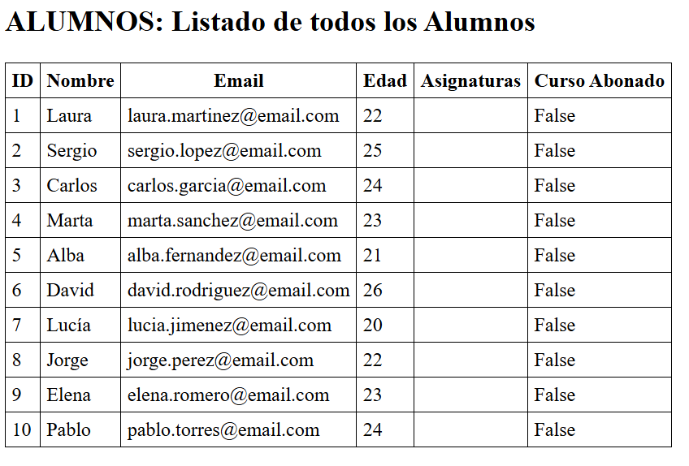
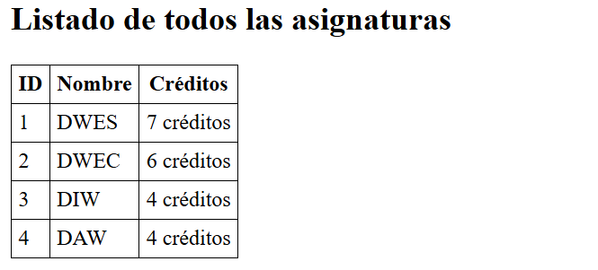
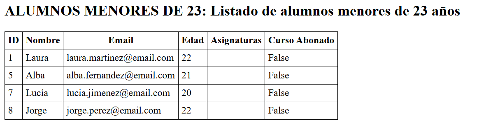
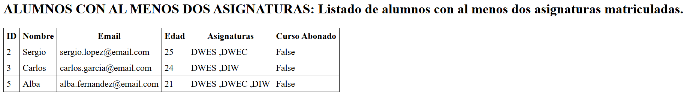
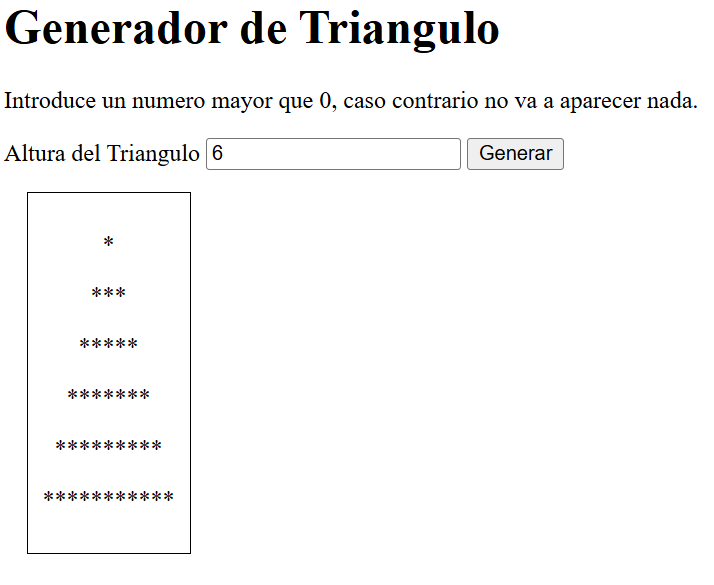
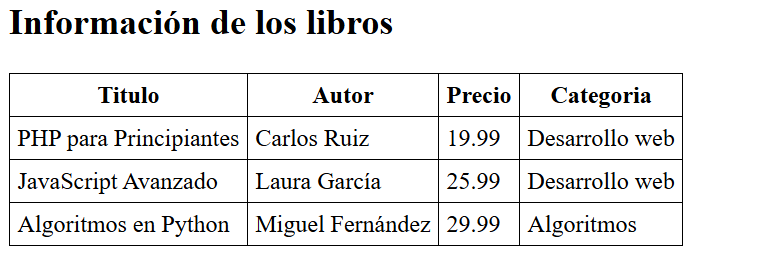
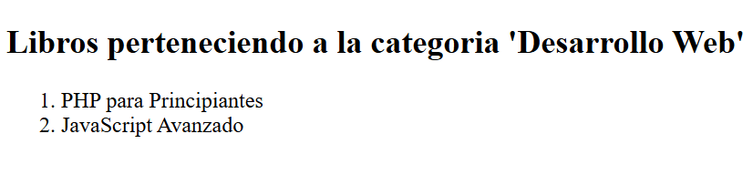

# dwes-t2-tarea

## Introducción:
Los distintos apartados por fotos del ejercicio 2 de DWES.
Como extra, he puesto un pequeño navegador para poder ir a las
distintas páginas con mayor facilidad.

### Clases  || index.html
    1- Listados de todos los alumnos.
    2- Listado de todos los profesores.
    3- Listado de todas las asignaturas.
    4- Listado de alumnos menores de 23 años.
    5- Listado de alumnos con al menos dos asignaturas matriculadas.
    6- Listado de asignaturas con al menos un alumno matriculado en las mismas. (Sin array_filter).

### Triangulo || triangulo.php

    1- Imprimir por pantalla la cadena que devuelve una llamada al método estático
    generateTriagnle() de TriangleGenerator, con altura de 6 o de la que tu le pases.
    siempre y cuando sea mayor que 0.

### Biblioteca.php 
    Pagina con arrays asociativos.
        1- Información de todos los libros
        2- Libros de la categoría "Desarrollo web"

#### Listado de todos los alumnos:

#### Listado de todos los profesores:

#### Listado de todas las asignaturas:

#### Listado de todos alumnos menores de 23 años:

#### Listado de alumnos con al menos dos asignaturas matriculadas:

### Triangulo || triangulo.php

He investigado como podría hacer esto más dinamico y he introducido un input para que el usuario
pueda introducir la altura que desea, conforme a los requisitos, si el usuario introduce un numero menor o igual a 0, devuelve una cadena vacia ' "" '. 

### Biblioteca.php 

#### Información de todos los libros

#### Libros de la categoría "Desarrollo web"

